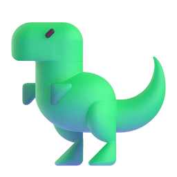
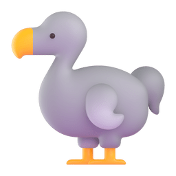

# WEB Developer 

## My Skills

### Proficiency

 = それなりに使える  
 = まあまあ使える  
 = なんとなく、勉強中  

### Favorite

 = 好き  
 = 普通  
 = 苦手  

<table>
	<tr>
		<th><strong>#</strong></th>
		<th><strong>Language</strong></th>
		<th><strong>Proficiency</strong></th>
		<th><strong>Favorite</strong></th>
	</tr>
	<tr>
		<td></td>
		<td><code>Javascript</code></td>
		<td></td>
		<td></td>
	</tr>
	<tr>
		<td></td>
		<td><code>Typescript</code></td>
		<td></td>
		<td></td>
	</tr>
	<tr>
		<td></td>
		<td><code>Python</code></td>
		<td></td>
		<td></td>
	</tr>
	<tr>
		<td></td>
		<td><code>PHP</code></td>
		<td></td>
		<td></td>
	</tr>
	<tr>
		<td></td>
		<td><code>GLSL</code></td>
		<td></td>
		<td></td>
	</tr>
	<tr>
		<td></td>
		<td><code>HTML</code></td>
		<td></td>
		<td></td>
	</tr>
	<td></td>
	<td><code>CSS(SCSS)</code></td>
	<td></td>
	<td></td>
	</tr>
</table>
<table>
	<tr>
		<th><strong>#</strong></th>
		<th><strong>Library Framework</strong></th>
		<th><strong>Proficiency</strong></th>
		<th><strong>Favorite</strong></th>
	</tr>
	<tr>
		<td></td>
		<td><code>React</code></td>
		<td></td>
		<td></td>
	</tr>
	<tr>
		<td></td>
		<td><code>Next.js</code></td>
		<td></td>
		<td></td>
	</tr>
	<tr>
		<td></td>
		<td><code>Astro</code></td>
		<td></td>
		<td></td>
	</tr>
	<tr>
		<td></td>
		<td><code>eleventy</code></td>
		<td></td>
		<td></td>
	</tr>
	<tr>
		<td></td>
		<td><code>Vite</code></td>
		<td></td>
		<td></td>
	</tr>
	<tr>
		<td></td>
		<td><code>Three.js</code></td>
		<td></td>
		<td></td>
	</tr>
	<tr>
		<td></td>
		<td><code>Flask</code></td>
		<td></td>
		<td></td>
	</tr>
	<tr>
		<td></td>
		<td><code>Fastapi</code></td>
		<td></td>
		<td></td>
	</tr>
	<tr>
		<td></td>
		<td><code>selenium</code></td>
		<td></td>
		<td></td>
	</tr>
	<tr>
		<td></td>
		<td><code>Jinja2</code></td>
		<td></td>
		<td></td>
	</tr>
	<tr>
		<td></td>
		<td><code>Nunjucks</code></td>
		<td></td>
		<td></td>
	</tr>
	<tr>
		<td></td>
		<td><code>Wordpress</code></td>
		<td></td>
		<td></td>
	</tr>
	<tr>
		<td></td>
		<td><code>jQuery</code></td>
		<td></td>
		<td></td>
	</tr>
</table>
<table>
	<tr>
		<th><strong>#</strong></th>
		<th><strong>Other</strong></th>
		<th><strong>Proficiency</strong></th>
		<th><strong>Favorite</strong></th>
	</tr>
	<tr>
		<td></td>
		<td><code>SQLite</code></td>
		<td></td>
		<td></td>
	</tr>
	<tr>
		<td></td>
		<td><code>PostgreSQL</code></td>
		<td></td>
		<td></td>
	</tr>
	<tr>
		<td></td>
		<td><code>GCP</code></td>
		<td></td>
		<td></td>
	</tr>
	<tr>
		<td></td>
		<td><code>Cloudflare</code></td>
		<td></td>
		<td></td>
	</tr>
	<tr>
		<td></td>
		<td><code>git</code></td>
		<td></td>
		<td></td>
	</tr>
	<tr>
		<td></td>
		<td><code>GitHub</code></td>
		<td></td>
		<td></td>
	</tr>
	<tr>
		<td></td>
		<td><code>vscode</code></td>
		<td></td>
		<td></td>
	</tr>
	<tr>
		<td></td>
		<td><code>Ubuntu(WSL)</code></td>
		<td></td>
		<td></td>
	</tr>
	<tr>
		<td></td>
		<td><code>Linux</code></td>
		<td></td>
		<td></td>
	</tr>
	<tr>
		<td></td>
		<td><code>Docker</code></td>
		<td></td>
		<td></td>
	</tr>
	<tr>
		<td></td>
		<td><code>Xserver</code></td>
		<td></td>
		<td></td>
	</tr>
	<tr>
		<td></td>
		<td><code>Vim</code></td>
		<td></td>
		<td></td>
	</tr>
	<tr>
		<td></td>
		<td><code>Photoshop</code></td>
		<td></td>
		<td></td>
	</tr>
	<tr>
		<td></td>
		<td><code>Illustrator</code></td>
		<td></td>
		<td></td>
	</tr>
</table>

 
 
 

	<h1>
		　　
		　　
		・・・
	</h1>

